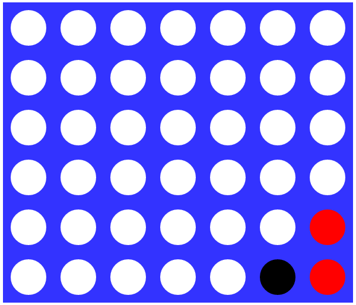

# Score Four
A mini in-browser game of [Connect Four](http://en.wikipedia.org/wiki/Connect_Four). Players take turns until someone gets four circles of their color in a row.

# Seriously?
Yes, I seriously built the simplest game I could think of. This is mostly a place for me to play with the ideas from [om](https://github.com/swannodette/om) and get my feet wet with [ClojureScript](https://github.com/clojure/clojurescript).

# Development
Running tests: $ lein cljsbuild auto test

Build: $ lein cljsbuild auto dev

Try it: open index.html in a browser

# Contributions
I would love to hear about what I did wrong. By all means tell me how to write better ClojureScript.
